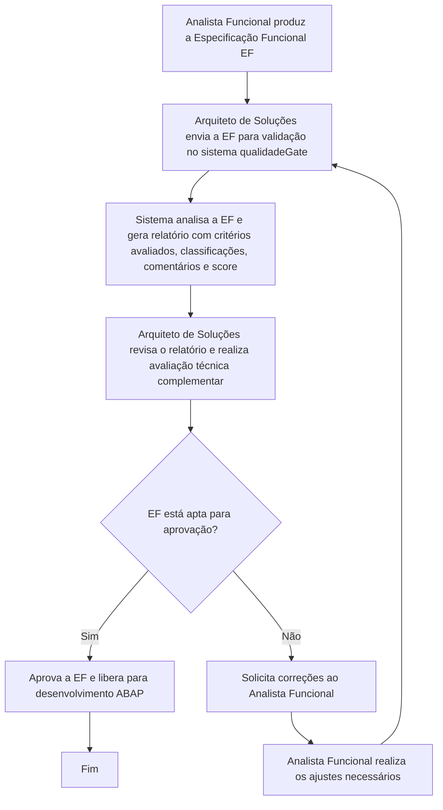
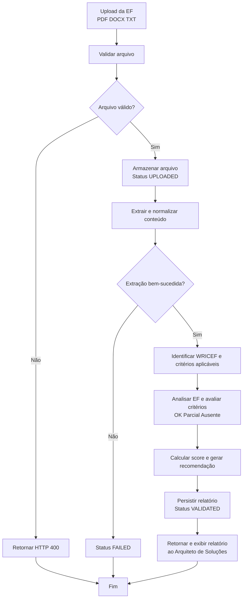

# Especificação do Projeto – EF Quality Check 

## Sistema para Verificação da Qualidade de Especificações Funcionais  

### Visão Geral 

#### Contexto 

Projetos SAP ABAP frequentemente iniciam desenvolvimento com Especificações Funcionais (EFs) incompletas, ambíguas ou sem os elementos técnicos mínimos (tabelas, BAPIs, BAdIs, transações). Isso gera retrabalho, paradas para esclarecimento e defeitos que só aparecem em fases tardias (QA/produção). 

**Processo atual (as-is)**: 

1. A equipe funcional **produz a EF**. 

2. O **arquiteto de soluções revisa manualmente** a EF quanto à qualidade e completude técnica. 

3. Somente após aprovação do arquiteto a EF segue para as demais etapas (desenvolvimento ABAP, testes, homologação). 

Essa revisão é hoje totalmente manual, dependente do arquiteto sênior e sem critérios padronizados, o que torna o passo 2 um gargalo do processo e gera avaliações inconsistentes entre times e squads. 

#### Objetivo 

Atuar como **ferramenta de apoio para o processo** de revisão de Especificações Funcionais, sem **substituir** o arquiteto, mas sim acelerando e padronizando sua análise. 

O sistema recebe a EF (PDF/DOCX/TXT), analisa contra critérios técnicos SAP ABAP e devolve ao arquiteto um relatório acionável com: 

- **Classificação preliminar** (APROVADO, ACEITAVEL, REPROVADO) que é calculado automaticamente pelo back-end a partir do checklist, sendo o resultado final; 

- **Campo único** que informa a **qualidade** do documento (alta, média e baixa); 

- **Demonstrativo do cálculo do Score** na interface do sistema; 

- **Checklist de todos os itens** classificados como **OK, Parcial e Ausente**; 

- **Comentários de cada item do checklist + Pontos críticos** identificados na EF; 

- **Cobertura das seções obrigatórias**; 

- **Resumo da Especificação Funcional**; 

- **Recomendações** para a Especificação; 

- **Parecer Final** sobre a análise  

O arquiteto usa o relatório como base para decidir, com maior velocidade e consistência, se libera a EF ou devolve ao funcional com correções. 

### Escopo 

#### Dentro do escopo (MVP) 

- Upload de EFs nos formatos **PDF e DOCX** (até 20 MB). 

- Extração de texto via **Apache Tika**. 

- Detecção heurística de tipo de desenvolvimento **DevType** (REPORT, ENHANCEMENT, INTERFACE, WORKFLOW, FORMS, BATCH, TABLE, ARQUIVO, TELA_FIORI, UNKNOWN). 

- Análise por IA (OpenAI GPT) sobre **15 critérios técnicos SAP ABAP**. 

- Análise programática de **cobertura de 12 seções obrigatórias**. 

- API REST documentada via **Swagger/OpenAI**. 

- Cálculo de score (0–100) e status, com relatório persistido em banco. 

- Interface web para upload, acompanhamento e consulta de relatórios. 

- Observabilidade via **Langfuse** (trace de spans: extração, normalização, análise, scoring). 

 

#### Fora do escopo (MVP) 

- **Substituir a decisão do arquiteto de soluções**. O sistema é assistivo; a aprovação formal permanece com o arquiteto. 

- Aprovação/reprovação automática que dispense revisão humana. 

- Autenticação, autorização e multi-tenant.z 

- Edição/versionamento do documento pelo próprio sistema. 

- Integração direta com SAP Solution Manager, ChaRM ou ferramentas ALM. 

- Idiomas diferentes de português brasileiro. 

 

### Fluxo de Negócio 

#### Fluxo end-to-end (processo com o sistema como apoio) 

 

**Observação:** o sistema **recomenda**, o **arquiteto decide**. A classificação **APROVADO/ACEITAVEL/REPROVADO** não libera automaticamente a EF para o próximo passo do processo. 

 

#### Fluxo interno de validação (passo 3 detalhado) 

 

 

 

 

 

 

 

 

### Histórias de Usuário 

**Usuário primário**: Arquiteto de Soluções (revisor da EF). Demais papéis são secundários. 

#### US-01 — Upload da EF para análise preliminar 

**Como** Arquiteto de Soluções, **quero** enviar a EF recebida do analista funcional (PDF e DOCX, até 20 MB) **para** obter uma análise preliminar automatizada antes de iniciar minha revisão manual. 

**Critérios de aceite**: 

- Aceita upload via drag-and-drop ou seleção de arquivo na tela. 

- Rejeita formato não suportado com mensagem clara ("Formato inválido. Selecione um arquivo PDF ou DOCX."). 

- Rejeita arquivos vazios ou acima de 20 MB com HTTP 400 e mensagem específica. 

- Após upload bem-sucedido, o documento fica com status UPLOADED. 

#### US-02 — Classificação e score preliminares 

**Como** Arquiteto de Soluções, **quero** ver a classificação sugerida (APROVADO, ACEITAVEL, REPROVADO) e o score (1–100) da EF **para** priorizar quais EFs revisar primeiro e quais devolver rapidamente ao funcional. 

**Critérios de aceite**: 

- Score é calculado de forma proporcional: **score = conquistado ÷ possível × 100** 

- O valor **possível** corresponde à soma dos pesos dos critérios aplicáveis à EF, variando de acordo com o tipo de desenvolvimento (WRICEF). 

- O valor **conquistado** corresponde à soma dos pesos efetivamente atendidos pela EF (100% do peso para OK, 50% para Parcial e 0% para Ausente). 

 
Os critérios e pesos considerados na avaliação são:  

- *Processo (3)* 

- *Objetivo e Escopo (4)*  

- *Casos de Uso Principais (4)* 

- *Fluxos Alternativos (5)*

- *Regras de Negócio (5)*  

- *Tratamento de Exceções (3)* 

- *Inputs e Outputs (4)* 

- *Condições de Teste (4)* 

- *Massa de Dados (5)* 

- *Campos e Estrutura de Dados (3, quando houver criação de tabelas)* 

- *Dependências (3, para Interface, Report e Conversão)* 

- *Controle de Acesso (3)* 

- *Volume de Dados (3)* 

- *Logs/Rastreabilidade (3)* 

- *Mensagens/Validações (3)* 

 
O cálculo proporcional garante que apenas critérios aplicáveis sejam considerados e impede aprovação indevida de EFs sem conteúdo. 

#### US-03 — Lista de problemas com classificação e comentários para correção 

*Como* Arquiteto de Soluções, *quero* receber uma lista de problemas identificados na EF, cada uma classificação (OK, Parcial e Ausente) e comentários detalhando a análise *para* consolidar rapidamente o retorno ao analista funcional sem redigir tudo manualmente. 

*Critérios de aceite*: 

- O resultado da validação retorna a lista completa dos critérios aplicáveis à EF. 

- Cada critério apresenta uma classificação com os valores permitidos: *OK, Parcial ou Ausente*. 

- Cada critério contém um comentário detalhando a análise realizada, evidenciando os pontos atendidos e/ou as lacunas identificadas. 

- Os critérios retornados respeitam as regras de aplicabilidade conforme o tipo de desenvolvimento (WRICEF). 

#### US-04 — Checklist de cobertura das seções 

*Como* Arquiteto de Soluções, *quero* ver a cobertura das 12 seções obrigatórias da EF (PRESENTE, PARCIAL, AUSENTE) *para* validar completude estrutural do documento de forma padronizada e objetiva. 

*Critérios de aceite*: 

- Análise executada por SectionAnalyzerService (heurística programática, não depende da IA). 

- Se conteúdo da seção tiver < 80 caracteres, classificar como PARCIAL. 

- Quando disponível, exibir o heading detectado no documento (detectedHeading). 

#### US-05 — Revalidar EF após correções 

**Como** Arquiteto de Soluções, **quero** reprocessar uma EF já enviada anteriormente sem precisar de novo upload para revalidar rapidamente após correções que passei ao funcional. 

**Critérios de aceite**: 

- Endpoint POST /api/v1/documents/{documentId}/validate reprocessa o binário já armazenado. 

- Reutiliza texto extraído em extracted_documents quando disponível, evitando reprocessar Tika. 

- Gera novo ValidationReportEntity sem descartar histórico anterior. 

#### US-06 — Histórico de documentos e relatórios 

*Como* Arquiteto de Soluções, *quero* consultar o histórico de EFs enviadas e seus relatórios *para* acompanhar a evolução da qualidade das especificações ao longo do tempo. 

*Critérios de aceite*: 

- GET /api/v1/documents retorna lista paginada (padrão 20 itens, ordenação por createdAt). 

- GET /api/v1/documents/{id} retorna detalhes de um documento. 

- Tela de documentos no frontend consome esses endpoints. 

#### US-07 — Recebimento do relatório pelo funcional 

*Como* Analista Funcional, *quero* receber do arquiteto o relatório consolidado com pontos positivos, problemas e comentários *para* corrigir a EF com foco nos pontos apontados e reduzir idas e vindas. 

*Critérios de aceite*: 

- Relatório contém recomendações, checklist completo, pontos críticos, recomendações e parecer final. 

- Todos os textos gerados em português. 

#### US-08 — Diagnóstico via Langfuse 

*Como* Operador/DevOps, *quero* inspecionar traces das execuções de validação *para* diagnosticar falhas e latência da pipeline (extração, normalização, chamada à OpenAI, scoring). 

*Critérios de aceite*: 

- Quando LANGFUSE_ENABLED=true, cada validação gera um trace com spans: text-extraction, normalization, section-analysis, chamada OpenAI e scoring. 

- Spans registram métricas (tamanho de texto, contagem de seções, score, status) e erros quando ocorrem. 

### Requisitos 

#### Requisitos Funcionais

| ID | Requisito |
|---|---|
| RF-01 | Aceitar upload multipart de arquivos PDF, DOCX ou TXT com limite de 20 MB. |
| RF-02 | Rejeitar arquivos vazios, com extensão/MIME não suportado ou acima do limite. |
| RF-03 | Persistir metadados do documento (nome original, nome armazenado, tipo, tamanho, status). |
| RF-04 | Expor endpoint de upload sem validação (POST /api/v1/documents). |
| RF-05 | Expor endpoint de upload + validação (POST /api/v1/documents/validate). |
| RF-06 | Expor endpoint de revalidação por ID (POST /api/v1/documents/{id}/validate). |
| RF-07 | Listar documentos com paginação (GET /api/v1/documents). |
| RF-08 | Consultar documento por ID (GET /api/v1/documents/{id}). |
| RF-09 | Consultar relatório por ID (GET /api/v1/validations/{reportId}). |
| RF-10 | Extrair texto bruto e páginas via Apache Tika a partir do binário armazenado. |
| RF-11 | Normalizar o texto extraído antes do envio à IA. |
| RF-12 | Detectar cobertura de 12 seções obrigatórias e classificar cada uma como PRESENTE, PARCIAL ou AUSENTE. |
| RF-13 | Detectar o tipo de desenvolvimento WRICEF e injetar critérios específicos no prompt do sistema. |
| RF-14 | Executar validação via OpenAI com prompt versionado, temperatura 0.0 e retry (até 3). |
| RF-15 | Calcular score e status final segundo ScoreCalculator. |
| RF-16 | Persistir relatório com issues, pontos critícos, seções ausentes e análise de risco. |
| RF-17 | Retornar relatório completo em JSON conforme ValidationReportResponse. |
| RF-18 | Registrar spans de execução no Langfuse quando habilitado (LANGFUSE_ENABLED=true). |
| RF-19 | Frontend deve permitir upload por drag-and-drop e por seleção de arquivo. |
| RF-20 | Frontend deve exibir relatório com status, score, issues agrupados por severidade e checklist de seções. |

#### Requisitos Não Funcionais

| ID | Requisito | Meta / Restrição |
|---|---|---|
| RNF-01 | Portabilidade de execução | Rodar com Docker Compose ou Podman Compose sem alteração de comandos. |
| RNF-02 | Tempo de resposta | Validação síncrona ≤ 120 s (timeout-seconds: 120) para documentos ≤ 20 MB. |
| RNF-03 | Escalabilidade vertical | Pool Hikari com 5–10 conexões; sem estado em memória entre requisições. |
| RNF-04 | Segurança de segredos | OPENAI_API_KEY, DB_PASSWORD e chaves Langfuse via variáveis de ambiente, nunca commitados. |
| RNF-05 | Segurança de entrada | Prompt do usuário isola conteúdo do documento em <documento_para_analise> para mitigar prompt injection. |
| RNF-06 | Observabilidade | Logs estruturados (Slf4j) e traces opcionais em Langfuse. Endpoints actuator/health e actuator/info expostos. |
| RNF-07 | Persistência versionada | Schema PostgreSQL gerenciado por Flyway (V1..Vn); ddl-auto: validate em runtime. |
| RNF-08 | Documentação de API | Swagger UI disponível em /swagger-ui.html. |
| RNF-09 | Compatibilidade | Java 21, Spring Boot 3.3, Next.js 16, React 19, TypeScript 5, PostgreSQL 16. |
| RNF-10 | Idempotência de upload | Nome armazenado único (stored_file_name UNIQUE) evita colisão. |
| RNF-11 | Determinismo da IA | temperature: 0.0 para reduzir variabilidade da avaliação. |
| RNF-12 | Resiliência | Retry configurável no cliente OpenAI (até 3 tentativas). |

### Regras de Negócio 

#### RN-01 — Formatos e tamanho 

- Apenas PDF, DOCX, TXT. Qualquer outro → rejeição imediata. 

- Tamanho máximo: **20 MB**. Acima → ResourceValidationException. 

#### RN-02 — Detecção de tipo de desenvolvimento 

Score de palavras-chave decide entre REPORT, ENHANCEMENT, INTERFACE, WORKFLOW, FORMS, BATCH, TABLE, ARQUIVO, TELA_FIORI ou UNKNOWN (score máximo < 2). O tipo detectado adiciona critérios específicos ao prompt. 

#### RN-03 — Cobertura de seções (12 obrigatórias) 

Objetivo, Escopo, Regras de Negócio, Fluxo do Processo, Objetos Técnicos, Transações SAP, Integrações, Tratamento de Erros, Cenários de Teste, Perfis e Autorizações, Responsáveis, Volume e Frequência. 

- Conteúdo detectado com < 80 caracteres → PARCIAL. 

- Heading não encontrado → AUSENTE. 

- Heading encontrado com conteúdo ≥ 80 caracteres → PRESENTE. 

#### RN-04 — Cálculo de score 

- O score é calculado de forma proporcional utilizando a fórmula: **score = conquistado ÷ possível × 100**. 

- O valor **possível** corresponde à soma dos pesos de todos os critérios aplicáveis à Especificação Funcional, considerando o tipo de desenvolvimento WRICEF. 

- O valor **conquistado** corresponde à soma dos pesos obtidos em cada critério avaliado: 

    - **OK**: 100% do peso do critério. 

    - **Parcial**: 50% do peso do critério. 

    - **Ausente**: 0% do peso do critério. 

- O score final é apresentado como percentual entre 0 e 100. 

- Apenas critérios aplicáveis são considerados no cálculo, garantindo avaliação proporcional e evitando aprovação indevida de EFs sem conteúdo. 

 

#### RN-05 — Status final

O status final da validação é determinado com base no score proporcional obtido pela Especificação Funcional (EF), considerando apenas os critérios aplicáveis ao tipo de desenvolvimento avaliado.

| Condição | Status |
|---|---|
| Score > 60 | APROVADO |
| Score ≤ 60 | ACEITAVEL |
| Score ≤ 39 | REPROVADO |

### Critérios de Validação 

A IA avalia a Especificação Funcional (EF) com base nos critérios de qualidade definidos em. Cada critério possui um peso e regras de aplicabilidade conforme o tipo de desenvolvimento (WRICEF).  

Para cada critério aplicável, a IA atribui uma classificação (OK, Parcial ou Ausente) e registra comentários justificando o resultado da avaliação. As classificações são utilizadas posteriormente no cálculo do score proporcional da EF. 

#### CR-01 — Descrição do Processo 

**Como avaliar**:  

Verificar se a EF descreve claramente o cenário atual e o cenário futuro, permitindo compreender o que existe hoje e o que será alterado após o desenvolvimento. 

Para ajustes pontuais, poucas frases objetivas são suficientes desde que a mudança esteja clara. Classificação: OK quando ambos os cenários estiverem claros; Parcial quando houver descrição vaga ou incompleta; Ausente quando não houver contexto do processo. 

#### CR-02 — Objetivo e Escopo 

*Como avaliar*:  

Verificar se a EF informa o objetivo da demanda, o problema a ser resolvido e o resultado esperado, além de delimitar o que faz parte da solução.  

Classificação: OK quando objetivo e escopo estiverem claros; Parcial quando houver informações genéricas ou incompletas; Ausente quando não houver definição. 

 

#### CR-03 — Casos de Uso Principais 

**Como avaliar**: 

Verificar se os principais cenários de utilização da solução estão descritos, identificando as ações esperadas pelos usuários ou sistemas envolvidos.  

Classificação: OK quando os cenários principais estiverem documentados; Parcial quando houver cobertura incompleta; Ausente quando não houver descrição. 

 
#### CR-04 — Fluxos Alternativos 

**Como avaliar**:  

Verificar se foram documentados caminhos alternativos ao fluxo principal, incluindo exceções operacionais e comportamentos diferenciados quando aplicável.  

Classificação: OK quando os principais fluxos alternativos estiverem descritos; Parcial quando a cobertura for limitada; Ausente quando inexistentes. 

 
#### CR-05 — Regras de Negócio 

**Como avaliar**:  

Verificar se as regras, validações, condições e restrições necessárias para implementação da solução estão claramente especificadas.  

Classificação: OK quando as regras forem claras e objetivas; Parcial quando houver ambiguidades; Ausente quando não existirem regras documentadas. 

 
#### CR-06 — Tratamento de Exceções 

**Como avaliar**:  

Verificar se a EF descreve o comportamento esperado em situações de erro, inconsistência ou falha de processo.  

Classificação: OK quando os cenários excepcionais estiverem adequadamente tratados; Parcial quando tratados de forma superficial; Ausente quando não houver referência. 

#### CR-07 — Inputs e Outputs 

**Como avaliar**:  

Verificar se as entradas necessárias para execução do processo e as saídas esperadas estão definidas de forma clara.  

Classificação: OK quando inputs e outputs estiverem identificados; Parcial quando houver informações incompletas; Ausente quando não houver definição. 

#### CR-08 — Condições de Teste 

**Como avaliar**:  

Verificar se existem cenários de teste, exemplos ou critérios que permitam validar o comportamento esperado da solução.  

Classificação: OK quando as condições de teste estiverem descritas; Parcial quando insuficientes; Ausente quando não houver qualquer referência. 

 
#### CR-09 — Massa de Dados 

**Como avaliar**:  

Verificar se há exemplos ou informações que permitam reproduzir o cenário funcional durante desenvolvimento e testes.  

Classificação: OK quando a massa de dados estiver definida; Parcial quando incompleta; Ausente quando inexistente. 

 
#### CR-10 — Campos e Estrutura de Dados 

Aplicável apenas quando houver criação ou alteração de estruturas de dados. 

**Como avaliar**: 

Verificar se campos, atributos, tabelas ou estruturas necessárias para implementação estão detalhados.  

Classificação: OK quando as definições estiverem completas; Parcial quando incompletas; Ausente quando necessárias e não documentadas. 

#### CR-11 — Dependências 

Aplicável para Interfaces, Relatórios e Conversões. 

**Como avaliar**:  

Verificar se sistemas, processos, integrações ou objetos dependentes foram identificados. Classificação: OK quando as dependências estiverem documentadas; Parcial quando incompletas; Ausente quando necessárias e não informadas. 

 
#### CR-12 — Controle de Acesso 

Aplicável a todos os tipos WRICEF. 

**Como avaliar**:  

Verificar se requisitos de acesso, perfis, autorizações ou restrições de segurança foram especificados. Classificação: OK quando documentados; Parcial quando insuficientes; Ausente quando não informados. 

 
#### CR-13 — Volume de Dados 

Aplicável para Reports, Interfaces, Conversões e Forms. 

**Como avaliar**:  

Verificar se foram informadas estimativas de volume, frequência de execução ou quantidade de registros processados. Classificação: OK quando houver dimensionamento adequado; Parcial quando genérico; Ausente quando não informado. 

### CR-14 — Logs e Rastreabilidade 

Aplicável a todos os tipos WRICEF. 

**Como avaliar**:  

Verificar se a solução prevê registro de execução, auditoria, rastreabilidade ou mecanismos de monitoramento quando aplicável. Classificação: OK quando descritos; Parcial quando superficiais; Ausente quando necessários e não documentados. 

 
#### CR-15 — Mensagens e Validações 

Aplicável a todos os tipos WRICEF. 

**Como avaliar**:  

Verificar se as mensagens ao usuário e validações funcionais esperadas estão documentadas. Classificação: OK quando claramente definidas; Parcial quando incompletas ou genéricas; Ausente quando não houver qualquer indicação. 

 
#### Detecção de tipo de Desenvolvimento 

Além dos 15 critérios acima, o PromptBuilderService detecta o tipo de desenvolvimento por palavras-chave. Tipos suportados e seus critérios específicos: 

- **REPORT**: variantes de seleção, layout de saída, formato de exibição (tela, Excel, PDF ou e-mail), volume de dados e execução em background. 

- **ENHANCEMENT**: processo impactado, ponto de extensão utilizado, condições de execução, regras de negócio e impacto no comportamento standard. 

- **INTERFACE**: sistemas envolvidos, tecnologia de integração, fluxo de dados, mapeamento de campos, tratamento de erros e estratégia de reprocessamento. 

- **WORKFLOW**: evento de disparo, etapas do processo, responsáveis, regras de aprovação, exceções e prazos (SLA) quando aplicável. 

- **FORMS**: tecnologia utilizada, layout esperado, dados de entrada, regras de geração/impressão e distribuição do documento. 

- **BATCH**: processamento em background, seleção de registros, tratamento de erros em massa, log de execução e estratégia de reprocessamento.

- **TABLE**: estrutura da tabela, campos e tipos de dados, relacionamentos, autorização de acesso e manutenção via SM30/SM31.

- **ARQUIVO**: tipo de arquivo, layout de campos (posição/delimitador), codificação, volume esperado, validações e tratamento de erros de leitura/escrita.

- **TELA_FIORI**: aplicativo Fiori alvo, tecnologia (Freestyle/Elements), entidades OData, ações disponíveis, campos exibidos e regras de autorização. 

 

### Regras de Qualidade 

#### RQ-01 — Prompt Engineering 

- System prompt versionado e único ponto de verdade (PromptBuilderService). 

- Uso obrigatório do bloco RACIOCINIO [ ... ] (Chain-of-Thought em scratchpad) antes do JSON final. 

- Proibido incluir campos de raciocínio dentro do JSON de resposta. 

- Temperature: 0.0 para máxima consistência entre execuções idênticas. 

#### RQ-02 — Contrato de saída da IA 

- JSON estrito conforme schema em AiValidationResponse — nenhum campo extra, sem markdown, sem cercas de código. 

- Arrays obrigatórios (issues, questions, positivePoints, missingSections) — [] quando não aplicável. 

- Enum status restrito a APROVADO | ACEITAVEL | REPROVADO. 

#### RQ-03 — Qualidade de código 

- Java 21 + Spring Boot 3.3; Lombok para reduzir boilerplate. 

- Camadas separadas: controller / service / repository / entity / dto / mapper / exception. 

- Testes unitários em src/test/java/com/company/specvalidator/service. 

#### RQ-04 — Migrações de banco 

- Toda mudança de schema via nova migração Flyway V{n}__descricao.sql. 

- Nunca alterar migração já aplicada; ddl-auto: validate bloqueia divergência. 

#### RQ-05 — Segurança de execução 

- Conteúdo do documento tratado como dado, não como instrução — mitigação de prompt injection via encapsulamento em <documento_para_analise>. 

- Segredos apenas por variáveis de ambiente e .env.app fora do controle de versão. 

- Sem persistência de conteúdo sensível em logs (apenas contagens/tamanhos). 

#### RQ-06 — Observabilidade 

- Logs em nível INFO para eventos de negócio (upload, extração, scoring, conclusão). 

- Traces Langfuse cobrindo: text-extraction, normalization, section-analysis, chamada OpenAI e scoring. 

- actuator/health exposto para readiness/liveness em ambiente containerizado. 

#### RQ-07 — Build e empacotamento 

- Backend com build multi-stage (Maven → Eclipse Temurin 21 JRE) via backend/Dockerfile. 

- Frontend com build multi-stage (Node → Next.js standalone) via frontend/Dockerfile. 

- Orquestração local via docker-compose.yml raiz (backend + frontend + PostgreSQL). 

#### RQ-08 — Frontend 

- Next.js 16 + React 19 + TypeScript (tsconfig.json). 

- Rota proxy /api/proxy/[...path] isola o backend do browser. 

- Componentes de shell (sidebar/topbar) reutilizáveis; feedback via sonner (toasts). 

- Drag-and-drop com fallback de seleção via input file. 

 

 

 